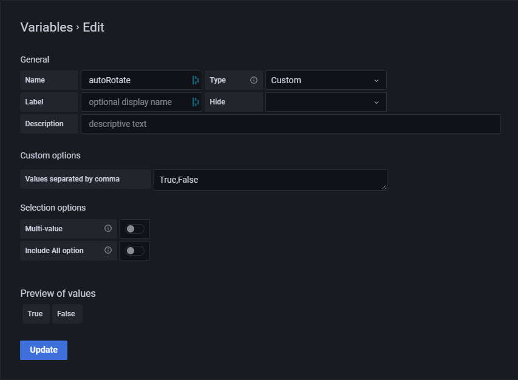

import Tabs from "@theme/Tabs";
import TabItem from "@theme/TabItem";

## Prerequisite

- [Docker](https://docker.com/) | [Install](https://docs.docker.com/get-docker/)
- [Docker compose](https://docs.docker.com/compose/) | [Install](https://docs.docker.com/compose/install/)
- [Grafana](https://grafana.com/) | [Install](https://grafana.com/docs/grafana/latest/installation/)

Grafana plugins

- [HTMLGraphics](https://gapit-htmlgraphics-panel.gapit.io/) | [Marketplace](https://grafana.com/grafana/plugins/gapit-htmlgraphics-panel/) | [Install](https://gapit-htmlgraphics-panel.gapit.io/docs/installation/)
- [JSON API](https://marcus.se.net/grafana-json-datasource/) | [Marketplace](https://grafana.com/grafana/plugins/marcusolsson-json-datasource/) | [Install](https://marcus.se.net/grafana-json-datasource/installation)

### Optional

- [Git](https://git-scm.com/) | [Install](https://git-scm.com/downloads)
- [Visual studio code](https://code.visualstudio.com/) | [Install](https://code.visualstudio.com/download)

<video width="100%" controls>
  <source src="/video/setup.mp4" type="video/mp4" />
  Your browser does not support the video tag.
</video>

## Get the backend/template

<Tabs
  groupId="version"
  defaultValue="template"
  values={[
    {label: 'Using template (requires git)', value: 'template'},
    {label: 'Using ZIP file', value: 'zip'},
  ]}>

<TabItem value="template">

1. Go to [grafana-360-viewer-backend-template](https://github.com/gapitio/grafana-360-viewer-backend-template).
2. Click "Use this template" and make a repo from the template.
3. Download the newly created repo onto to your local machine.

</TabItem>

<TabItem value="zip">

1. Go to [grafana-360-viewer-backend-template](https://github.com/gapitio/grafana-360-viewer-backend-template).
2. Download the repo onto to your local machine. Click on "Code" then "Download ZIP".
   
3. Unzip the zip file.

</TabItem>
</Tabs>

## Configure the backend

<Tabs
  groupId="grafana-installed-type"
  defaultValue="docker"
  values={[
    {label: 'Grafana installed with docker', value: 'docker'},
    {label: 'Grafana installed with other methods', value: 'other'},
  ]}>

<TabItem value="docker">

Set the correct network name in the `docker-compose.yml` file. The network name should (usally) be the same as the grafana service network name.

Change your password and token. [Guide: How to change password](guides/how-to-change-password.md).

</TabItem>

<TabItem value="other">

Change your password and token. [Guide: How to change password](guides/how-to-change-password.md).

</TabItem>
</Tabs>

## Run the backend

:::tip
Start the backend on boot or when the docker restarts. [Guide: How to start backend on boot](guides/how-to-start-backend-on-boot.md).
:::

To start the backend with [docker compose](https://docs.docker.com/compose/). Go to the folder with the `docker-compose.yml` file (the backend folder that was downloaded previously) and run the following command.

```bash
docker-compose up -d
```

## Setup grafana data source (JSON API)

Add the [JSON API data source](https://marcus.se.net/grafana-json-datasource/). [Guide: Add a data source](https://grafana.com/docs/grafana/latest/datasources/add-a-data-source/).


With the following settings.

_Name can be anything and URL has to be the nginx container name and the port number_

<Tabs
  groupId="grafana-installed-type"
  defaultValue="docker"
  values={[
    {label: 'Grafana installed with docker', value: 'docker'},
    {label: 'Grafana installed with other methods', value: 'other'},
  ]}>

<TabItem value="docker">

_Name can be anything and URL has to be the nginx container name and the port number_

- Name = grafana-360-viewer-backend
- URL = grafana-360-viewer-backend:8080

</TabItem>

<TabItem value="other">

_Name can be anything and URL has to be the nginx container name and the port number_

- Name = grafana-360-viewer-backend
- URL = localhost:3203

</TabItem>
</Tabs>


### Get the data source id

Open the developer tools in your browser (Control+Shift+I) and navigate to the network tab.

Click on "Save & test".

Note down the number in the network tab (Needed for later).


## Setup dashboard

:::caution
Some errors might pop up on the dashboard. Like `Error updating options: invalid input syntax for type integer: ""`. This is expected as there is nothing in the database. Don't worry about it yet.
:::

You can import the following <a target="_blank" href="pathname:///json/panel.json" download="grafana-360-viewer-panel.json">panel json (download)</a>. [Guide: Import dashboard](https://grafana.com/docs/grafana/latest/dashboards/export-import/#import-dashboard).

Or you can add the dashboard manually by following the below steps.

### Setup variables

[Guide: How to add variables](https://grafana.com/docs/grafana/latest/variables/variable-types/add-query-variable/).

#### area

- Variable name = `area`
- Type = `Query`

Query options taken from the [json model (templating -> query)](https://grafana.com/docs/grafana/latest/dashboards/json-model/#templating). If the json seems complicated you can just look at the images below.

`query options`

```json
{
  "cacheDurationSeconds": 300,
  "experimentalVariableTextField": "Text",
  "experimentalVariableValueField": "Value",
  "fields": [
    {
      "jsonPath": "$.*.area_key",
      "name": "Value",
      "type": "number"
    },
    {
      "jsonPath": "$.*.area_name",
      "language": "jsonpath",
      "name": "Text",
      "type": "string"
    }
  ],
  "method": "GET",
  "queryParams": "",
  "urlPath": "/areas"
}
```


### scene

- Variable name = `scene`
- Type = `Query`

Query options taken from the [json model (templating -> query)](https://grafana.com/docs/grafana/latest/dashboards/json-model/#templating). If the json seems complicated you can just look at the images below.

`query options`

```json
{
  "cacheDurationSeconds": 300,
  "experimentalVariableTextField": "Text",
  "experimentalVariableValueField": "Value",
  "fields": [
    {
      "jsonPath": "$.*.scene_key",
      "name": "Value"
    },
    {
      "jsonPath": "$.*.scene_name",
      "language": "jsonpath",
      "name": "Text"
    }
  ],
  "method": "GET",
  "queryParams": "",
  "urlPath": "/scenes?area_key=eq.${area}"
}
```


### autoRotate

- Variable name = `autoRotate`
- Type = `Custom`
- Values separated by comma = `True,False`

```json
[
  {
    "selected": true,
    "text": "True",
    "value": "True"
  },
  {
    "selected": false,
    "text": "False",
    "value": "False"
  }
]
```



### Setup queries

Create a panel. [Guide: Add a panel](https://grafana.com/docs/grafana/latest/panels/add-a-panel/)

Create a 3 queries. areas, scenes, and hotspots.

Query targets taken from the json panel model. If the json seems complicated you can just look at the images below.

:::caution
Change the uid if you're using the json model.
:::

```json
[
  {
    "cacheDurationSeconds": 300,
    "datasource": {
      "type": "marcusolsson-json-datasource",
      "uid": "datasource-uid"
    },
    "fields": [
      {
        "jsonPath": "$",
        "name": "Value"
      }
    ],
    "method": "GET",
    "queryParams": "",
    "refId": "areas",
    "urlPath": "/areas"
  },
  {
    "cacheDurationSeconds": 300,
    "datasource": {
      "type": "marcusolsson-json-datasource",
      "uid": "datasource-uid"
    },
    "fields": [
      {
        "jsonPath": "$",
        "name": "Value"
      }
    ],
    "hide": false,
    "method": "GET",
    "queryParams": "",
    "refId": "scenes",
    "urlPath": "/scenes?area_key=eq.${area}"
  },
  {
    "cacheDurationSeconds": 300,
    "datasource": {
      "type": "marcusolsson-json-datasource",
      "uid": "datasource-uid"
    },
    "fields": [
      {
        "jsonPath": "$",
        "name": "Value"
      }
    ],
    "hide": false,
    "method": "GET",
    "queryParams": "",
    "refId": "hotspots",
    "urlPath": "/hotspots?area_key=eq.${area}"
  }
]
```


### Setup grafana panel (HTMLGraphics)

1. Add the [HTMLGraphics panel](https://gapit-htmlgraphics-panel.gapit.io/). [Guide: How to add the HTMLGraphics panel](https://gapit-htmlgraphics-panel.gapit.io/docs/guides/how-to-add-the-panel/).
2. Go to the latest release of [Grafana 360 viewer](https://github.com/gapitio/grafana-360-viewer/releases) and download the `grafana-360-viewer-<version>-panel-options.json` from the assets.
3. Import the downloaded file to the HTMLGraphics panel. [Guide: How to import/export](https://gapit-htmlgraphics-panel.gapit.io/docs/guides/how-to-import-export/).
4. Go to the Custom properties options on the sidebar.
5. Change isGrafana to true.
6. Change the api url to the proxy path. `/api/datasources/proxy/datasource-id/`. datasource-id is the number from [Get the data source id](#get-the-data-source-id) section.
7. Change the api token to token saved in the `token.txt` file. The token from [Configure the backend​](#configure-the-backend) section after changing the password and token.


